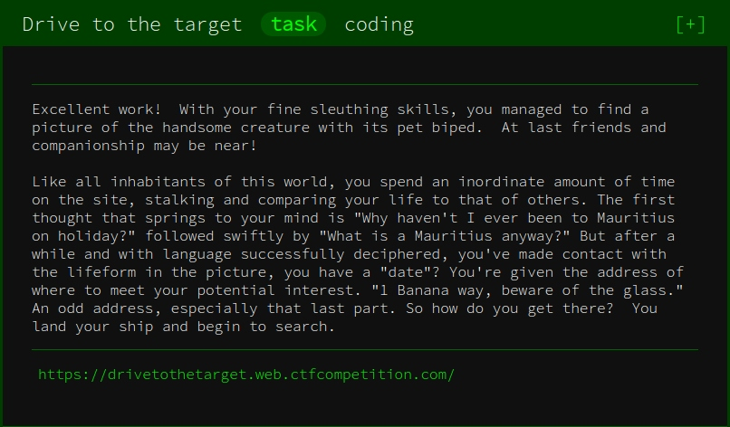
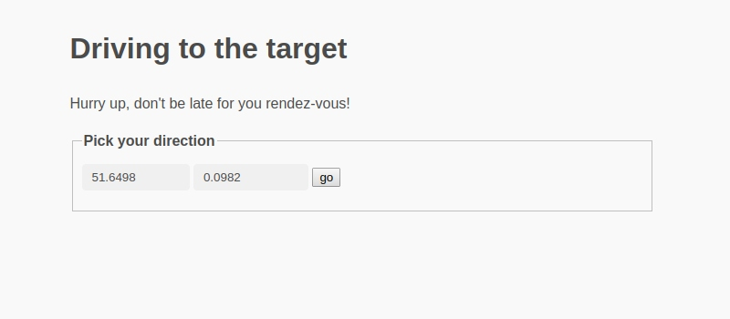
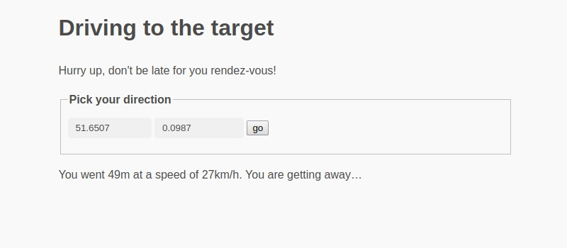
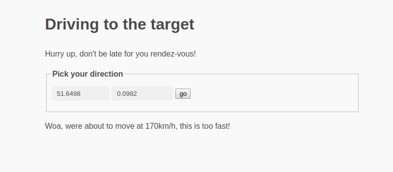
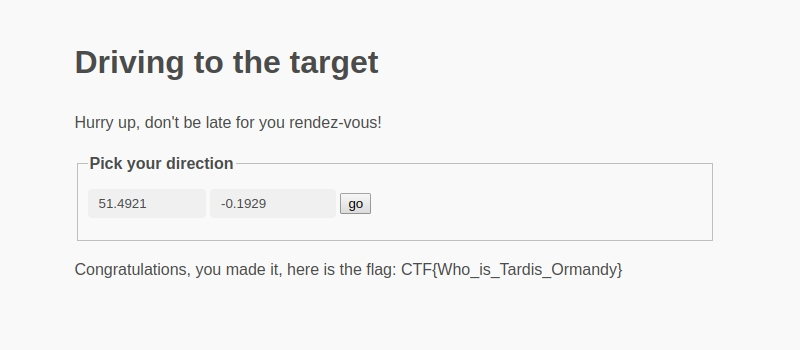

## Write-up: Drive to the Target

Google CTF 2019: [Beginner’s Quest](https://capturetheflag.withgoogle.com/#beginners/)



This is a `coding` challenge about finding the right coordinates of the target: <https://drivetothetarget.web.ctfcompetition.com>



A message tells us whether we are “getting closer” or “getting away” from the target:



The URL has three parameters: `lat`, `lon` and `token`: <https://drivetothetarget.web.ctfcompetition.com/?lat=51.6507&lon=0.0987&token=gAAAAABdEz5ayGhccq-sfNR5MWK4Xv-Q8IH1okHTahnCed-WpxKmPhiDxrR5A0ajVJyjAQdqwKZM1fJ9ZPs3s7g9D8YpAKRDpstfcwQreNLKx453eDL0KywyFS9HV6YQFT6AZtmAE-9e>

`token` contains a timestamp of some sort, which is how the application detects when we are traveling too fast (at least 50 km/h):



One strategy is to travel in one direction (`lat` or `lon`) until we are “getting away” from the target for the first time and then to travel perpendicular until we are “getting away” again. We can speed this up by driving to the target in a straight line.

A little trick helps us determine the direction of the target:

* Remember a specific location’s `lat`, `lon` and `token` values.
* From this point, drive in multiple directions and observe whether we are “getting away” or “getting closer”.
* In between two directions where we are both getting away and closer, the distance between us and the target remains roughly the same.
* Turn 90 degrees to face the target.

The principle is outline here (see the [code below](#code) for the complete solution):

```python
    def recalc_angle(self):
        last_facing = None
        for angle in range(0, 361, 4):  # 0: north, 90: east, 180: south, 270: west
            dx, dy = move(angle, 0.0001)
            response = request(self.lat + dy, self.lon + dx, self.token)

            facing = 'away' if response.is_moving_away() else 'closer'
            if facing == 'closer' and last_facing == 'away':
                self.angle = angle + 88
                return
            else:
                last_facing = facing
```

This is only an approximation and introduces some errors (such as assuming a 2-dimensional Euclidean plane), but by recalculating our direction every now and then, we can reduce the time it takes to reach the target to about 40 minutes.

Once we are close enough to the target, we find the flag:



<https://drivetothetarget.web.ctfcompetition.com/?lat=51.4921&lon=-0.1929&token=gAAAAABdD7TmGy_v7DkVKysnHPkZO8e4mC7bgsQzZTPYhLeAc8VYeM2eyZp7QBlnaTh_epEoxodoKCIWv79yFOXQ4mfOK5MXgWr41kNS00DSYV30Im97PchNQVY6VsA6oacxbUL-Vgki>

**Flag**: `CTF{Who_is_Tardis_Ormandy}`

## Code

[./driving.py](https://github.com/weibell/ctf-google2019-beginners/blob/master/write-up/day6-easier/driving.py)

```python
import math
import re
import time
import requests
from bs4 import BeautifulSoup


# Finds the target in about 40 minutes.
class Driver:

    def __init__(self):
        self.response = request(init=True)
        self.lat = self.response.lat
        self.lon = self.response.lon
        self.token = self.response.token

        self.angle = 0
        self.steps_since_recalc = 0
        self.recalc_angle()

        self.step_size = 0.0001

    def run(self):
        self.step()
        while not self.response.is_done():
            while self.response.is_moving_closer():
                self.print_status()
                time.sleep(1)
                if self.response.speed() < 48:
                    self.step_size *= 1.005
                if self.steps_since_recalc > 120:
                    self.recalc_angle()
                else:
                    self.steps_since_recalc += 1
                self.step()

            if self.response.is_moving_away():
                self.print_status()
                self.recalc_angle()
                self.step_size = 0.0001
                self.step()

            elif self.response.is_too_fast():
                self.step_size *= .99
                self.step()

            elif self.response.is_done():
                self.print_status()
                return self.response
        self.print_status()

    def step(self):
        dx, dy = move(self.angle, self.step_size)
        response = request(self.lat + dy, self.lon + dx, self.token)
        if response.is_moving_closer():  # only update location if moving closer
            self.lat = response.lat
            self.lon = response.lon
            self.token = response.token
        self.response = response

    def recalc_angle(self):
        #  Sets self.angle to the approximate direction of the target.
        #  Assumes a 2-d Euclidean plane, which introduces somewhat of an error.
        self.steps_since_recalc = 0
        print('Recalculating angle ', end='')
        last_facing = None
        for angle in range(0, 361, 4):  # 0: north, 90: east, 180: south, 270: west
            print('.', end='', flush=True)
            dx, dy = move(angle, 0.0001)

            response = request(self.lat + dy, self.lon + dx, self.token)
            while response.is_too_fast():
                time.sleep(1)
                response = request(self.lat + dy, self.lon + dx, self.token)

            if response.is_done():
                self.angle = angle
                print()
                return

            facing = 'away' if response.is_moving_away() else 'closer'
            if facing == 'closer' and last_facing == 'away':
                self.angle = angle + 88
                print()
                return
            else:
                last_facing = facing

    def print_status(self):
        print(f'{self.response.msg} | lat: {self.response.lat:.15f} | lon: {self.response.lon:.15f}'
              f' | angle: {self.angle}° | URL: {self.response.get_url()}')


class Response:
    def __init__(self, msg, lat, lon, token):
        self.msg = msg
        self.lat = lat
        self.lon = lon
        self.token = token

    def is_moving_closer(self):
        return 'getting closer' in self.msg

    def is_moving_away(self):
        return 'getting away' in self.msg

    def is_too_fast(self):
        return 'too fast' in self.msg

    def is_not_moving(self):
        return 'you should move' in self.msg

    def is_done(self):
        return not (self.is_moving_closer() or self.is_moving_away()
                    or self.is_too_fast() or self.is_not_moving())

    def speed(self):
        return int(re.findall('\\b(\\d+)km/h', self.msg)[0])

    def get_url(self):
        return f'https://drivetothetarget.web.ctfcompetition.com/?lat={self.lat}&lon={self.lon}&token={self.token}'


def request(lat=None, lon=None, token=None, init=False):
    if init:
        link = 'https://drivetothetarget.web.ctfcompetition.com/'
    else:
        link = f'https://drivetothetarget.web.ctfcompetition.com/?lat={lat}&lon={lon}&token={token}'
    soup = BeautifulSoup(requests.get(link).text, 'html.parser')

    msg = soup.find_all('p')[-1].get_text()
    new_lat = float(soup.find('input', {'name': 'lat'}).get('value'))
    new_lon = float(soup.find('input', {'name': 'lon'}).get('value'))
    new_token = soup.find('input', {'name': 'token'}).get('value')
    return Response(msg, new_lat, new_lon, new_token)


def move(angle, distance):
    rad = math.radians(angle)
    dx = math.sin(rad) * distance
    dy = math.cos(rad) * distance
    return dx, dy


if __name__ == '__main__':
    driver = Driver()
    driver.run()
```

